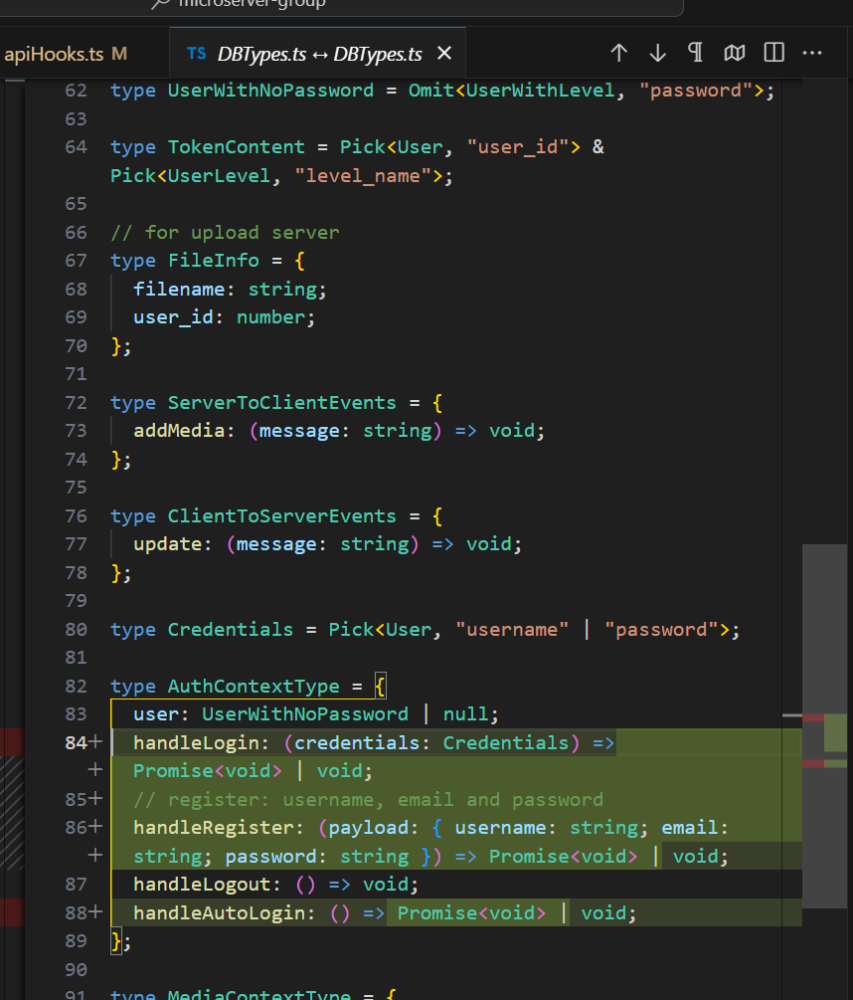
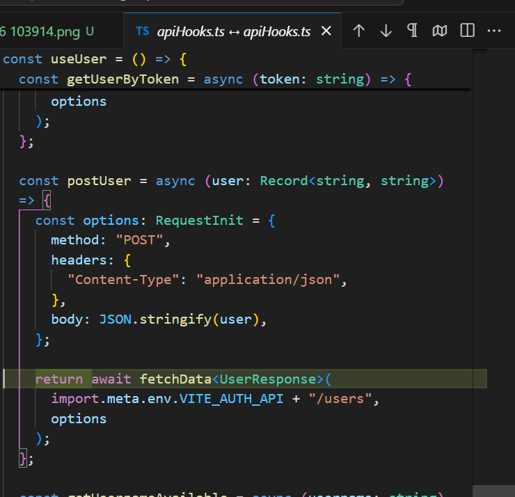
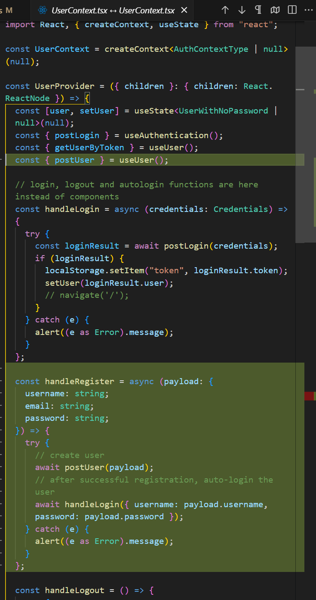
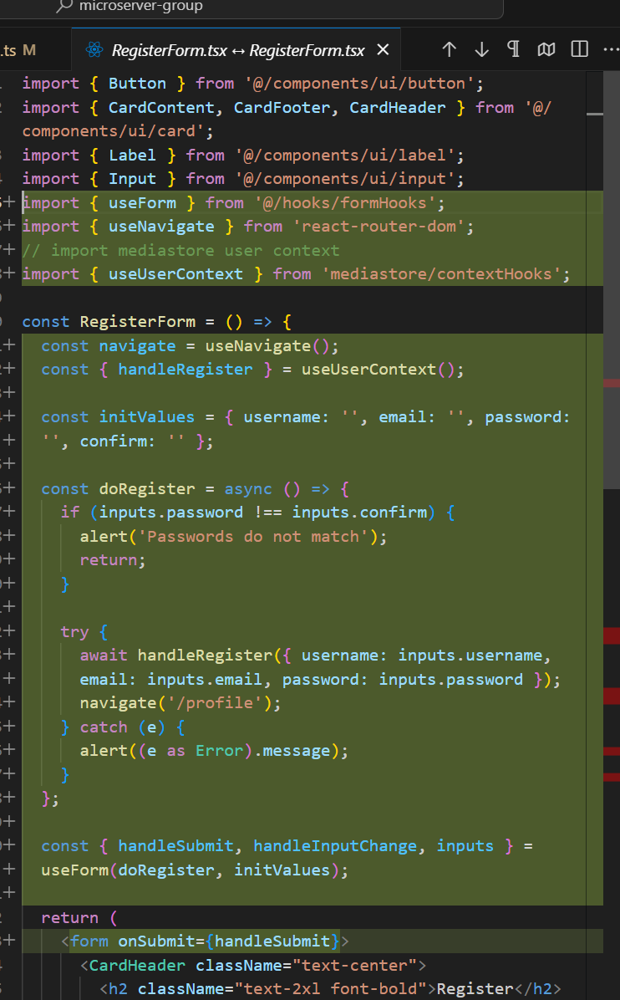
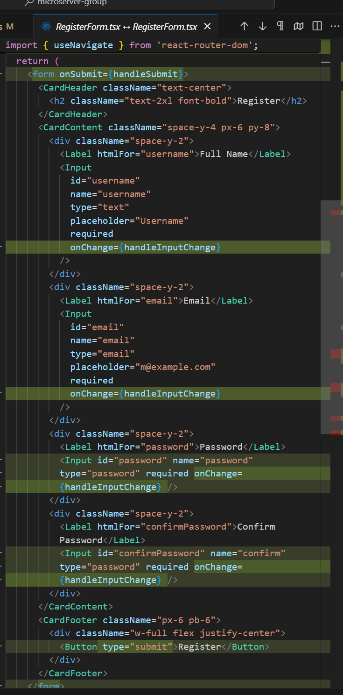

# micro-front
## added handleRegister to shared DBTypes.ts

## changed postUser to return response in apiHooks.ts

added handleRegister in UserContext.tsx and exposed it

RegisterForm.tsx to call handleRegister and navigate to /profile

